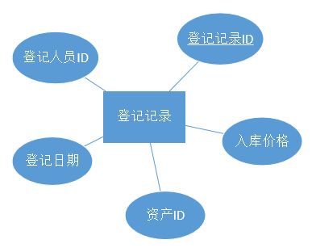

资产管理系统的开发

摘 要

本文从实际出发，首先进行了需求分析。将实际问题转换成ER图，并将ER模型转化成数据模型。由此给出了数据字典和数据库的整体逻辑设计。

接着分析了web开发使用的后台框架django。举了域名解析和视图返回的例子。以及分析了djngo
ORM的特点，说明了利用Django后台框架调用MySQL的方法。

接着给出了网站各个模块的效果和实现方法。包括网站首页，登录注册页面，权限管理，员工管理，资产管理，邀请码机制，记录回滚机制，资产管理系统等。最后对功能做了总结给出了功能框图

最后对全文进行了总结。同时所有的代码已经上传至：https://github.com/wyf0912/Comprehensive-Course-Design
。

**关键词：**MySQL应用，记录回滚恢复机制，Web开发，邀请码，权限管理，python后台开发，Django,
资产管理

目 录

[摘 要 I](#_Toc515814098)

[目 录 II](#_Toc515814099)

[第一章 绪 论 1](#_Toc515814100)

>   [1.1 研究工作的背景与意义 1](#_Toc515814101)

>   [1.2 本文的主要贡献与创新 1](#_Toc515814102)

>   [1.3 本论文的结构安排 1](#_Toc515814103)

[第二章 数据库模型的设计 2](#_Toc515814104)

>   [2.1 需求分析 2](#_Toc515814105)

>   [2.2 ER图 2](#_Toc515814106)

>   [2.2.1 设计局部E-R模式 2](#_Toc515814107)

>   [2.2.2 设计全局ER图 6](#_Toc515814108)

>   [2.4 ER模型向数据模型的转换 6](#_Toc515814109)

>   [2.5 数据字典 8](#_Toc515814110)

>   [2.6 数据库的逻辑设计 10](#_Toc515814111)

[第三章 网站的后台设计 12](#_Toc515814112)

>   [3.1 后台框架的选择 12](#_Toc515814113)

>   [3.2 框架概述 12](#_Toc515814114)

>   [3.3 请求的响应 12](#_Toc515814115)

>   [3.3.1 域名的解析 12](#_Toc515814116)

>   [3.3.2 视图的返回 13](#_Toc515814117)

>   [3.3 与数据库的连接 13](#_Toc515814118)

[第四章 网站的整体设计 14](#_Toc515814119)

>   [4.1 网站首页 14](#_Toc515814120)

>   [4.2 登录和注册 15](#_Toc515814121)

>   [4.2.1 注册系统 15](#_Toc515814122)

>   [4.2.2 登录界面 18](#_Toc515814123)

>   [4.2.3 密码在数据库中的存储 18](#_Toc515814124)

>   [4.3 部门及权限管理 19](#_Toc515814125)

>   [4.3.1 部门及权限管理界面 19](#_Toc515814126)

>   [4.3.2 权限管理的实现 20](#_Toc515814127)

>   [4.4 邀请码机制 21](#_Toc515814128)

>   [4.4.1 邀请码系统的界面和功能 21](#_Toc515814129)

>   [4.4.2 邀请码的实现 23](#_Toc515814130)

>   [4.5 员工管理系统 23](#_Toc515814131)

>   [4.6 资产管理部分 24](#_Toc515814132)

>   [4.6.1 资产列表 24](#_Toc515814133)

>   [4.6.2 资产登记管理系统 25](#_Toc515814134)

>   [4.6.3 资产申领管理系统 26](#_Toc515814135)

>   [4.6.4 资产维修管理系统 27](#_Toc515814136)

>   [4.6.5 折旧管理系统 27](#_Toc515814137)

>   [4.6.6折旧记录回滚和恢复机制 28](#_Toc515814138)

>   [4.7 系统功能整体框 30](#_Toc515814139)

[第四章 全文总结与展望 31](#_Toc515814140)

>   [4.1 全文总结 31](#_Toc515814141)

>   [4.2 后续工作展望 31](#_Toc515814142)

[致 谢 32](#_Toc515814143)

[参考文献 33](#_Toc515814144)

第一章 绪 论

1.1 研究工作的背景与意义

当今社会正快速向信息化社会前进。信息系统的作用也越来越大，特别是一些企业或组织等，往往需要管理大量的资产数据。对这些资产信息，往往需要安全的，高效率的管理方式。而数据库系统及其应用就大大提高了资产管理的效率，减轻了工作人员的工作压力，提供了友好的人机交互界面。同时数据库的数据结构化，数据的低冗余性以及独立性等特性大大提升了资产管理的效率。同时数据的安全性保护与故障恢复等技术，满足了实际应用中对数据安全性的要求。

1.2 本文的主要贡献与创新

本文以资产管理系统需求为切入点。针对资产，设计了资产登记，领用，折旧以及维修管理等模块。针对应用中的实际需求，设计了权限管理模块，员工和部门管理模块，登录注册模块。并且为了管理方便，增加了邀请码模块，邀请码中包含了权限，有效期，有效次数等信息。

并完成了网站前端和后台的设计，实现了美观，简洁，高效和友好的人机交互界面。

同时设置了跨站访问限制以及人机验证，防止对网站的攻击和破坏。

1.3 本论文的结构安排

本文的章节结构安排如下：

第二章：需求的分析和数据库的设计

第三章：后台的搭建及特点

第四章：网站的实现和功能

第五章：总结

第二章 数据库模型的设计

2.1 需求分析

本系统的基本要求是实现如下功能或模块：

（1）资产登记管理模块：增删改查资产信息；  
（2）资产领用管理模块：增删改查资产领用记录；  
（3）资产折旧管理模块：根据不同的折旧方法计算资产的折旧金额和残值；  
（4）维修管理模块：增删改查维修记录信息

（5）员工和部门管理模块：可以添加删除员工和部门

（6）权限管理模块：记录员工和部门的权限信息

（7）登陆注册模块：实现用户的登陆和注册

（8）邀请码模块：邀请码种包含权限信息，用户使用邀请码注册后可以自动获得对应模块的权限信息

（9）利用GUI或网站设计，实现人机友好交互界面

所以在本系统重要管理的信息主要有：资产信息，资产领用信息，资产折旧信息，维修记录信息等。因此存储此部分信息需要如下4个表：资产信息表，资产领用记录表，资产折旧记录表与维修记录表。为了达到第三范式，我们需要消除依赖，因此我们额外增加了资产种类表。

此为了实现多用户的登录与管理，还需要对用户帐号，权限及部门等信息进行管理，因此，数据库中还包括员工信息表，部门信息表，用户信息表，权限信息表。

为了实现邀请码功能，添加了表用来存储邀请码信息。

2.2 ER图

E-R的设计分为局部设计、全局设计两个内容。因为该需求较为复杂，所以实验中先设计局部E-R图，然后将局部E-R图整合成全局E-R图。

2.2.1 设计局部E-R模式

设计局部E-R模式的主要工作是要确定出实体和联系的定义、属性的分配，以及根据系统的实际情况，恰当地划分出各个分系统的局部结构范围。

资产信息主要包括资产ID,资产价值，资产名称，资产种类ID，资产种类名称。为了实现第三范式，设计了两张表来消除依赖。

图1 资产局部ER图

资产登记记录主要包含了登记人员的ID，登记记录的ID,登记日期以及所登记的资产ID,其局部ER图如下图。

图2 资产登记局部ER图

同样，折旧记录包括折旧时间，折旧记录ID，操作人的ID以及资产ID。并且为了记录资产价值的变化情况，额外增加了折旧种类，折旧金额以及残值的属性。

图3 资产折旧局部ER图

领用记录与的属性与上述类似，其局部E-R图如下图：

图4 资产领用局部ER图

资产维修模块分为了两个表，维修记录表和维修详情表。

图5 资产维修局部ER图

此外，为了实现多用户的登录及分权限管理等操作，还需要表来记录用户，部门及登录相关的数据。为此使用了三张表来记录人员信息，部门信息，及不同的权限等级所拥有的权限。

图6 人事部门及权限局部ER图

此外，为了实现登录的验证功能，设计了一张表用来存放登录验证信息。用来存放登录名，邮箱地址，登录密码以及唯一的职工号。

图7 账户及图片存储ER图

2.2.2 设计全局ER图

数据模型反映信息之间的联系，实际上，数据模型定义了数据库。在这个资产管理系统设计中，用E-R图来描述系统的数据库概念模式。我们抽象出资产信息表，资产领用记录表，资产折旧记录表与维修记录表，资产种类表。以及为了实现多用户的登录与管理，抽象出的人员信息表，部门信息表，账户信息表，权限信息表。

实体具有属性，如资产实体具有价值、名称和ID等，联系也可以具有属性。每个实体和每个实体之间的联系分别各用一张表来储存信息。实体间的联系有多种方式，如一对一、一对多、多对一和多对多等。每个关系都可以在数据库中以一个数据表来进行创建，所以在进行数据库设计之前一般要先进行实体与联系的分析和创建。

图8 主体部分全局ER图

我们将之前的部分ER图进行了整合，得到了上图的资产部分整体E-R图。

2.4 ER模型向数据模型的转换

此资产管理系统的表都属于函数依赖集。

资产信息表：

U={资产ID,资产价值，资产种类ID，资产名称}

F={资产ID——\>资产价值，资产ID——\>资产种类ID, 资产ID——\>资产名称}

候选码为资产ID

资产领用记录表：

U={经办人ID，领用人ID，领用记录ID，领用日期，资产ID，归还日期}

F={领用记录ID——\>经办人ID，领用记录ID——\>领用人ID，领用记录ID——\>领用日期，领用记录ID——\>资产ID，领用记录ID——\>归还日期}

候选码为领用记录ID

资产折旧记录表

U={折旧时间，折旧记录ID,折旧金额，残值，资产ID,操作人ID，折旧种类ID}

F={折旧记录ID——\>折旧时间，折旧记录ID——\>折旧金额，折旧记录ID——\>残差，折旧记录ID——\>资产ID,
折旧记录ID——\>操作人ID, 折旧记录ID——\>折旧种类ID }

候选码为折旧记录ID

资产登记记录表

U={登记时间，登记记录ID,入库单价，资产ID,操作人ID，资产入库照片}

F={登记记录ID——\>登记时间，登记记录ID——\>入库单价，登记记录ID——\>资产ID,
登记记录ID——\>操作人ID, 登记记录ID——\>资产入库照片}

候选码为登记记录ID

维修记录表，资产种类表，人员信息表，部门信息表，账户信息表，权限信息表等，均与上述示例一样，满足如下的性质：

1.它们的每个非主属性都完全函数依赖于码，首先R=2NF；

2.它们的每一个非主属性既不部分依赖于码也不传递依赖于码，再次R=3NF；

2.5 数据字典

**资产信息(asset)**

| 列名          | 数据类型      | 最大长度 | 是否为空 | 键  | 备注       |
|---------------|---------------|----------|----------|-----|------------|
| asset_id      | int(11)       |          | NO       | PRI | 资产ID     |
| asset_name    | varchar(45)   | 45       | NO       |     | 资产名称   |
| asset_val     | decimal(18,2) |          | NO       |     | 资产价值   |
| asset_kind_id | int(11)       |          | YES      | MUL | 资产种类ID |

**资产折旧信息(asset_depreciate)**

| 列名            | 数据类型      | 最大长度 | 是否为空 | 键  | 备注         |
|-----------------|---------------|----------|----------|-----|--------------|
| depreciate_id   | int(11)       |          | NO       | PRI | 折旧记录ID   |
| depreciate_date | datetime(6)   |          | NO       |     | 折旧记录日期 |
| depreciate_val  | decimal(18,2) |          | YES      |     | 折旧值       |
| residual_value  | decimal(18,2) |          | YES      |     | 剩余价值     |
| asset_id        | int(11)       |          | YES      | MUL | 折旧资产ID   |
| depreciate_kind | int(11)       |          | YES      | MUL | 折旧种类     |
| staff_id        | int(11)       |          | YES      | MUL | 操作员工ID   |

**资产种类信息(asset_kind)**

| 列名      | 数据类型    | 最大长度 | 是否为空 | 键  | 备注         |
|-----------|-------------|----------|----------|-----|--------------|
| kind_id   | int(11)     |          | NO       | PRI | 资产种类ID   |
| kind_name | varchar(45) | 45       | NO       |     | 资产种类名称 |

**资产申领信息(asset_requset)**

| 列名                | 数据类型    | 最大长度 | 是否为空 | 键  | 备注       |
|---------------------|-------------|----------|----------|-----|------------|
| request_id          | int(11)     |          | NO       | PRI | 申领记录ID |
| request_date        | datetime(6) |          | NO       |     | 申领日期   |
| request_return_date | datetime(6) |          | YES      |     | 归还日期   |
| request_staff_id    | varchar(45) | 45       | YES      |     | 申领人姓名 |
| asset_id            | int(11)     |          | YES      | MUL | 资产ID     |
| operator_staff_id   | int(11)     |          | YES      | MUL | 操作人员ID |

**资产登记信息(asset_register)**

| 列名          | 数据类型    | 最大长度 | 是否为空 | 键  | 备注           |
|---------------|-------------|----------|----------|-----|----------------|
| register_id   | int(11)     |          | NO       | PRI | 资产登记记录ID |
| register_data | datetime(6) |          | NO       |     | 资产登记时间   |
| Staff_img_id  | Int(11)     | 100      | YES      | MUL | 员工照片ID     |
| asset_id      | int(11)     |          | YES      | MUL | 资产ID         |
| staff_id      | int(11)     |          | YES      | MUL | 操作员工ID     |

**资产维修信息(asset_repair)**

| 列名            | 数据类型    | 最大长度 | 是否为空 | 键  | 备注       |
|-----------------|-------------|----------|----------|-----|------------|
| repair_id       | int(11)     |          | NO       | PRI | 维修记录ID |
| repair_time     | datetime(6) |          | NO       |     | 维修时间   |
| repair_asset_id | int(11)     |          | YES      | MUL | 维修资产ID |
| repair_staff_id | int(11)     |          | YES      | MUL | 维修人员ID |

**注册用户信息(auth_user）**

| 列名         | 数据类型     | 最大长度 | 是否为空 | 键  | 备注   |
|--------------|--------------|----------|----------|-----|--------|
| id           | int(11)      |          | NO       | PRI | 用户ID |
| password     | varchar(128) | 128      | NO       |     |        |
| last_login   | datetime(6)  |          | YES      |     |        |
| is_superuser | tinyint(1)   |          | NO       |     |        |
| username     | varchar(150) | 150      | NO       | UNI |        |
| first_name   | varchar(30)  | 30       | NO       |     |        |
| last_name    | varchar(150) | 150      | NO       |     |        |
| email        | varchar(254) | 254      | NO       |     |        |
| is_staff     | tinyint(1)   |          | NO       |     |        |
| is_active    | tinyint(1)   |          | NO       |     |        |
| date_joined  | datetime(6)  |          | NO       |     |        |

**邀请码信息(asset_invite_key)**

| 列名              | 数据类型     | 最大长度 | 是否为空 | 键  | 备注 |
|-------------------|--------------|----------|----------|-----|------|
| Id                | int(11)      |          | NO       | PRI |      |
| Times             | int(11)      |          | NO       |     |      |
| Key               | varchar(100) | 100      | NO       |     |      |
| ddl_time          | datetime(6)  |          | NO       |     |      |
| dept_id           | int(11)      |          | NO       | MUL |      |
| operator_staff_id | int(11)      |          | YES      | MUL |      |

**员工信息(Staff)**

| 列名         | 数据类型 | 最大长度 | 是否为空 | 键  | 备注       |
|--------------|----------|----------|----------|-----|------------|
| Id           | int(11)  |          | NO       | PRI | 员工ID     |
| user_id      | int(11)  |          | NO       | MUL | 用户ID     |
| dep_id       | int(11)  |          | NO       | MUL | 部门ID     |
| Staff_img_id | Int(11)  | 100      | YES      | MUL | 员工照片ID |

**部门信息(asset_staff)**

| 列名             | 数据类型    | 最大长度 | 是否为空 | 键  | 备注       |
|------------------|-------------|----------|----------|-----|------------|
| dep_id           | int(11)     |          | NO       | PRI | 部门ID     |
| dep_name         | varchar(45) | 45       | NO       |     | 部门名称   |
| dep_permmison_id | int(11)     |          | NO       | MUL | 部门权限ID |

**照片信息(asset_photos)**

| 列名     | 数据类型     | 最大长度 | 是否为空 | 键  | 备注       |
|----------|--------------|----------|----------|-----|------------|
| img_id   | int(11)      |          | NO       | PRI | 部门ID     |
| img_name | varchar(30)  | 30       | NO       |     | 部门名称   |
| Img      | varchar(100) | 100      | NO       |     | 部门权限ID |

**折旧种类信息(asset_depreciate_kind)**

| 列名               | 数据类型    | 最大长度 | 是否为空 | 键  | 备注       |
|--------------------|-------------|----------|----------|-----|------------|
| depreciate_kind_id | int(11)     |          | NO       | PRI | 折旧种类   |
| depreciate_name    | varchar(45) | 45       | NO       |     | 折旧种类名 |
| depreciate_cal     | varchar(45) | 45       | NO       |     | 折旧表达式 |

2.6 数据库的逻辑设计

如下是资产管理系统的关系图：

由于关系图模型太大所以将其拆分程了两张图，第一张图主要是资产管理模块，如下图：

图9 数据库设计部分1

下图主要是用户权限信息及邀请码功能部分的结构图

图10 数据库设计部分2

第三章 网站的后台设计

3.1 后台框架的选择

Python作为当前最火爆最热门，也是最主要的Web开发语言之一，在其二十多年的历史中出现了数十种Web框架，比如Django、Tornado、Flask、Twisted、Bottle和Web.py等，它们有的历史悠久，有的发展迅速，还有的已经停止维护。

而Django是重量级选手中最有代表性的一位。许多成功的网站和APP都基于Django。Django是一个开放源代码的Web应用框架，由Python写成。且Django的手册较为丰富，便于学习和开发。我们网站后台主要使用python语言，利用django进行开发。

Django采用了MVC的软件设计模式，即模型M，视图V和控制器C。

3.2 框架概述

拥有强大的数据库操作接口（QuerySet
API），如需要也能执行原生SQL。拥有强大的数据库操作接口（QuerySet
API），如需要也能执行原生SQL。

3.3 请求的响应

3.3.1 域名的解析

域名的解析使用正则表达式，通过正则表达式可以：

**测试字符串内的模式。**

可以测试输入字符串，以查看字符串内是否出现电话号码模式或信用卡号码模式。这称为数据验证。

**替换文本。**

可以使用正则表达式来识别文档中的特定文本，完全删除该文本或者用其他文本替换它。

**基于模式匹配从字符串中提取子字符串**。

可以查找文档内或输入域内特定的文本。

我们在域名解析中使用正则表达式，主要是为了从字符串中提取子字符串。例如:<http://127.0.0.1:8000/assets/assetdepreciate/>

我们通过正则表达式，可以先提取出assets，即我们的应用名称。然后在asset的基础上，提取出assetdepreciate，也就是资产折旧记录对应的view。

这样的好处是，可以实现应用的模块化。例如assets/就对应整个的资产管理系统的域名。

3.3.2 视图的返回

在访问域名对应的视图时，django会将request的内容作为参数传入视图函数。Request的变量里面包含get或post的内容。例如用户浏览器，系统等信息。以及注册登陆或其他表单信息。

在view函数中针对不同的request返回不同的html页面，就实现了简易的web服务的搭建。

3.3 与数据库的连接

与数据库连接经过了django的封装。数据库中的每个表对应python代码中的一个Module类。数据库中的每一行，对应python中类的实例。

class Asset(models.Model):

asset_id = models.AutoField(primary_key=True)

asset_kind = models.ForeignKey('AssetKind', models.DO_NOTHING, blank=True,
null=True)

asset_name = models.CharField(max_length=45)

asset_val = models.DecimalField(max_digits=18, decimal_places=2)

例如如上为定义资产的部分代码。Django提供了一对一，一对多，多对多的支持。Django中的的外键与mysql中的有些区别。例如mysql提供键值的关联，而django是ORM，也就是对象关系映射。

>   图11 ORM示意图

>   上图为ORM的示意图。这样，我们在具体的操作实体对象的时候，就不需要再去和复杂的SQL语句打交道，只需简单的操作实体对象的属性和方法。ORM技术是在对象和关系之间提供了一条桥梁，前台的对象型数据和数据库中的关系型的数据通过这个桥梁来相互转化。

>   CREATE TABLE \`asset\` (

>   \`asset_id\` int(11) NOT NULL AUTO_INCREMENT,

>   \`asset_name\` varchar(45) NOT NULL,

>   \`asset_val\` decimal(18,2) NOT NULL,

>   \`asset_kind_id\` int(11) DEFAULT NULL,

>   PRIMARY KEY (\`asset_id\`),

>   KEY \`asset_asset_kind_id_d7902bcb_fk_asset_kind_kind_id\`
>   (\`asset_kind_id\`),

>   CONSTRAINT \`asset_asset_kind_id_d7902bcb_fk_asset_kind_kind_id\` FOREIGN
>   KEY (\`asset_kind_id\`) REFERENCES \`asset_kind\` (\`kind_id\`)

>   ) ENGINE=InnoDB AUTO_INCREMENT=3 DEFAULT CHARSET=utf8;

上述代码为django进行migration操作时，将Module类转换为SQL语句的过程

第四章 网站的整体设计

4.1 网站首页

网站首页采用HTML+JS+CSS开发，简介大方。通过滚动鼠标，可以了解资产管理系统的优势和特点，并且提供了联系方式Github地址。

以及提供了注册和登陆的按钮。

以及提供了注册和登陆的按钮。

图12 网站首页

4.2 登录和注册

4.2.1 注册系统

4.2.1.1注册系统的界面

图13 注册页面

注册页面提供了表单的有效性的验证，以及验证码验证。并在后台通过查询数据库检测用户是否已经注册过。

4.2.1.2 注册界面的实现

为了保证整个网站风格的统一，我们借鉴了django的css文件。同时为了保证注册模块的可扩展性，我们编写了模板文件。

>   \<form method = 'post' enctype="multipart/form-data" id="login-form"\>

>   

>   

>   \

>   {{ field.label_tag }}{{ field }}

>   {{ field.errors }}

>   \</div\>

>   

>   \<input type="submit" value = "注册" id="TencentCaptcha"
>   data-appid="2036447301"

>   data-cbfn="check"\>

>   \<!--input type="submit" value = "注册"--\>

>   \</form\>

模板文件的作用是提供一个可复用的html框架。模板中可以实现循环，赋值，条件判断和过滤器等操作。例如上述代码展示了如何从表单中读取数据。

Python后台读取模板文件以后，依据模板生成对应的HTML网页，并返回给浏览里。

同时通过django的静态文件机制，存储js和css文件。并在html模板文件中进行调用。

\<link rel="stylesheet" type="text/css" href="" /\>

\<script src="https://ssl.captcha.qq.com/TCaptcha.js"\>\</script\>

\<script type="text/javascript" src=""\>\</script\>

例如上述部分代码展示了对静态CSS,JS文件的调用。

客户的浏览器将验证合法性的表单通过POST方法提交到服务器后，后台再对表单进行验证，检查用户是否重复，密码是否合法等。若没有问题，将密码用算法加密后进行存储。

4.2.1.3 验证码机制

传统的验证码主要通过对字母数字等进行扭曲变形，并添加噪声等生成。对用户非常不友好，且随着计算机视觉的发展，变得越来越容易被破解。

所以我们采用了新形的验证码。

图

14 验证码模块

不仅能更好的进行恶意对抗，用户体验上还更流畅和简单。
网站接入交互型验证码后，页面只需显示验证区域让用户进行单击。

用户在浏览器上完成验证，会返回得到一个ticket。将ticket随表单内容一起上传到后台服务器。后台服务器把ticket内容向验证码服务商进行验证，若验证通过且表单注册信息有效，则注册成功。

4.2.2 登录界面

图16 登陆页面

4.2.3 密码在数据库中的存储

注册信息中的密码在数据库中没有使用明文存储，而是使用pbkdf2_sha256算法对其加密。防止数据库数据的意外泄露导致用户隐私泄露，从而引发危害。

图17 密码的存储

可以在用户修改界面中修改用户的注册信息，权限以及员工状态等。资产管理系统提供了更加详细的员工信息及所属部门和对应权限的管理，此部分仅为网站管理员管理网站信息时使用。

4.3 部门及权限管理

4.3.1 部门及权限管理界面

我们可以在系统中添加不同的部门，并且赋予其不同的权限。

图18 部门及权限页面

例如我们暂时设立了如下几个部门，并将刚刚注册的用户WangYufei划归到折旧管理部门。右图为用户WangYufei登陆后所能看到的视图，仅仅包含其权限包括的部分。

图19 不同权限用户不同的视图

实现了不同权限用户的不同视图。

4.3.2 权限管理的实现

权限管理的数据由数据库中的多张表来管理。下图为其在数据库中的存储。

图20 权限管理依赖的数据表

每名员工对应一个user账户，每个user账户对应一个group，group与department之间也是一一对应关系。每个group对应一个group的权限。根据当前登录用户的信息，就可以通过数据库查询到他的学权限信息，并返回对应的页面。

4.4 邀请码机制

邀请码机制同样是本系统的一个特色。

4.4.1 邀请码系统的界面和功能

每个邀请码包含权限信息，剩余激活次数，过期时间等信息。

图21邀请码信息

如上图所示，当邀请码次数用完或者过期后，状态信息自动变为失效，邀请码无法使用。利用邀请码注册的用户自动得到对应部门的权限。

图22 使用邀请码注册

例如我们使用人事部门的有效的邀请码，注册一个测试用户。注册成功后，登陆该账号。

图23 使用邀请码注册后获得对应的权限

如图所示，该用户已经自动获得了对应部门的权限。打开邀请码后，我们可以看到，对应邀请码的剩余次数已经减一。

4.4.2 邀请码的实现

邀请码的文本中包含了两部分信息：邀请码ID和随机检验码，通过base64进行编码。

4.4.2.1 生成邀请码

1在网站中填写邀请码的权限信息，使用次数，过期时间等等信息

2..invite_key的表中建立邀请码的信息，主键ID值自动生成

3.后台将邀请码的ID和后台生成的随机数字符串进行组合，并使用base64进行编码，将编码后的字
符串存储到invite_key表中的key属性。

4.通过前台显示相应信息

4.4.2.2 验证邀请码：

1.  注册页面向服务器提交注册信息表单

2.  检验表单信息并尝试对邀请码进行base64解码

3.  查找解码得到的ID号对应的key值，与邀请码进行比较

4.  如果上一步校验正确，邀请码有效次数减一，用户分配到对应部门，并赋予相应的权限。

4.5 员工管理系统

员工管理展示了员工的ID，用户名，照片等数据，如下图所示

图24 员工列表界面

照片可以单击得到大图（和资产登记列表的照片类似）。

图25 员工管理界面

通过修改员工所属的部门，可以将员工赋予不同的权限。

4.6 资产管理部分

4.6.1 资产列表

图26 资产列表界面

资产列表首页显示了资产ID，资产名称，资产价值，资产种类以及资产维修记录数，资产折旧记录数，资产申领及登记数。支持搜索以及使用资产种类进行分类。并且维修，折旧，申领及登记记录的超链接可以点开，到达对应的详情页面。如下图所示

图27 跳转后的详情界面

自动跳转到了资产申领记录表的相应结果。其中资产申领记录表中会显示是否归还的状态信息。

4.6.2 资产登记管理系统

资产登记管理系统的界面如下，包含了登记员工，入库时间，登记时间，以及入库时候的照片等信息。右侧照片的缩略图可以单击放大为大图。

图28 资产登记界面

图29 资产登记的大图展示

例如上图为点击缩略图后的效果。

图片在数据库中的存储形式为字符串，保存的是图片的路径。

4.6.3 资产申领管理系统

下图为资产管理系统的资产的添加界面，修改界面与之类似，为了节省空间没有再展示。将资产属性进行了分类。

图30 添加资产申领的记录的页面

其中加粗字体的属性为必填属性。系统在提交表单的时候会进行验证。非加粗字体的属性，即归还时间为非必填属性，归还时间应在归还时补充填写。若没有填写归还时间，则数据显示时会显示为未归还，反之为已归还。

图31 添加资产申领的状态及查询页面

上图红色字体提示未归还，绿色提示已经归还。考虑到资产申领人可能不是企业内部的人员，所以资产申领人员的数据类型为字符串。

4.6.4 资产维修管理系统

图30 维修记录页面

上图为资产维修管理系统的截图

4.6.5 折旧管理系统

图32 折旧管理及查询页面

折旧管理系统以及其他的各个模块都包括了增加、删除、查找等功能。如下图所示，只需要选择折旧的资产、折旧时间和折旧种类，系统将会自动记录操作人员，并根据折旧的种类和当前价值计算折旧的价值和剩余的价值。并且我们可以在当前页面点击折旧种类的加号，添加折旧种类信息。

，

图33 折旧种类及公式的添加管理示例

折旧种类支持复杂的数学表达式，表达式中x的值代表资产的当前价值，表达式的值为折旧后的残余价值，例如例子中折旧表达式为：

$$
x = p\text{ow}\left( x,0.5 \right)
$$

资产的原始价值为36.58，开根号后为6.05。

4.6.6折旧记录回滚和恢复机制

同时，系统在删除了折旧记录（包括中间的记录）以后，还会自动的恢复到正确的价格。系统会按照时间顺序，回滚到删除记录的前一天记录所在的状态，并将剩余未执行的折旧记录重新执行。

图34 修改折旧记录后数据的正确性

回滚的原理与git的原理类似，下图未删除操作回滚的示意图

图35 折旧记录的回退修改原理

绿色代表已经成功执行的操作（即折旧公式已经执行），红色代表删除的操作，灰色代表待执行的操作，箭头代表当前的状态。

4.7 系统功能整体框

图36 系统功能大致框图

不同用户根据其权限，会有不同的视图。系统管理员有额外的权限修改用户的注册信息、用户的权限信息，以及权限分组等，以及其他所有模块的权限。其他员工拥有对应模块的权限组合。例如：人事管理部门的员工拥有邀请码模块，部门模块，以及员工模块的权限。其可以发放删除修改邀请码，修改员工的部门信息或者修改不同部门所拥有的权限。

第四章 全文总结与展望

4.1 全文总结

本文首先介绍了实际需求，针对需求设计了数据库的ER图以及数据模型，数据字典。

接着简单介绍了后台框架的选择及原因。及Django的特性和web服务的部分实现。

第三章中，给出了系统的部分功能以及部分功能的实现原理。并给予了一些截图予以展示。最后对系统的功能进行了总结。

4.2 后续工作展望

后续考虑对界面进行进一步美化。其次加入数据库的备份及恢复等功能。同时进一步增加网站的安全性。

致 谢

本课程设计的工作是在我的导师符朝旭老师悉心指导下完成的。

老师对我课设的方向做出了指导性的意见和推荐，在完成作品和论文撰写过程中及时对我遇到的困难和疑惑给予悉心指点，提出了许多有益的改善性意见，投入了很多的心血和精力。

在此向符朝旭老师表示诚挚的谢意!

参考文献

1.  Django Software Foundation. Django documentation.[N/OL]
    https://docs.djang-oproject.com/en/2.0 , 2018-06-02

2.  ORACLE, MySQL Documentation.[N/OL] https://dev.mysql.com/doc/ ,2018-06-03

3.  Thomas M. Connolly.数据库系统-设计、实现与管理[M].机械工业出版社.2018-1-1
